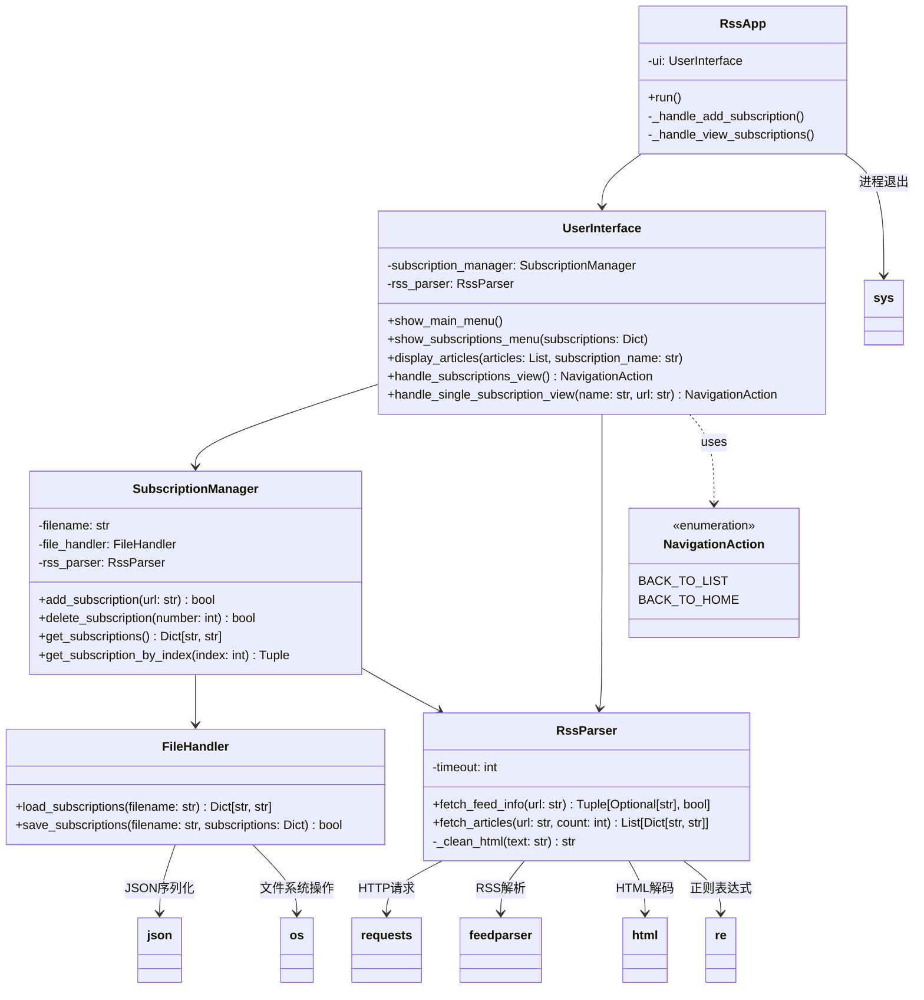
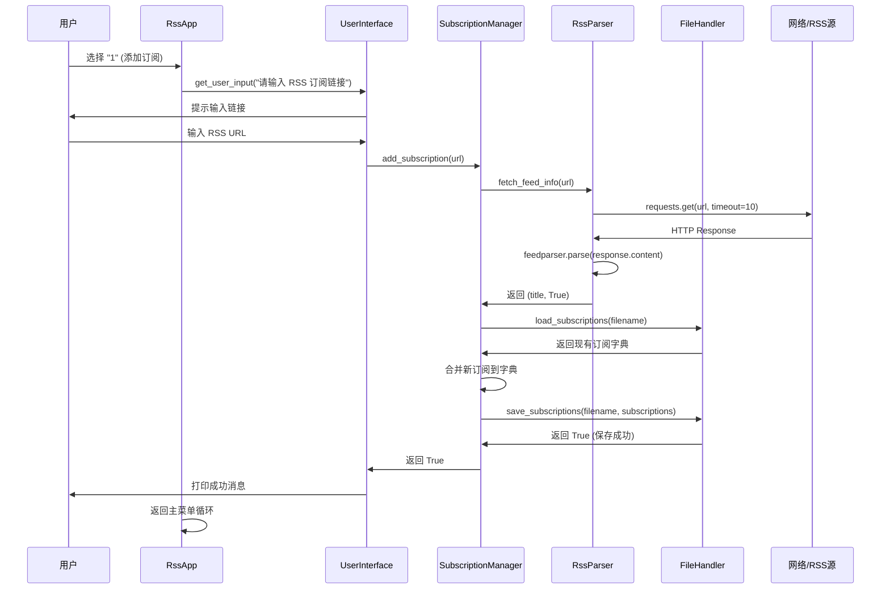
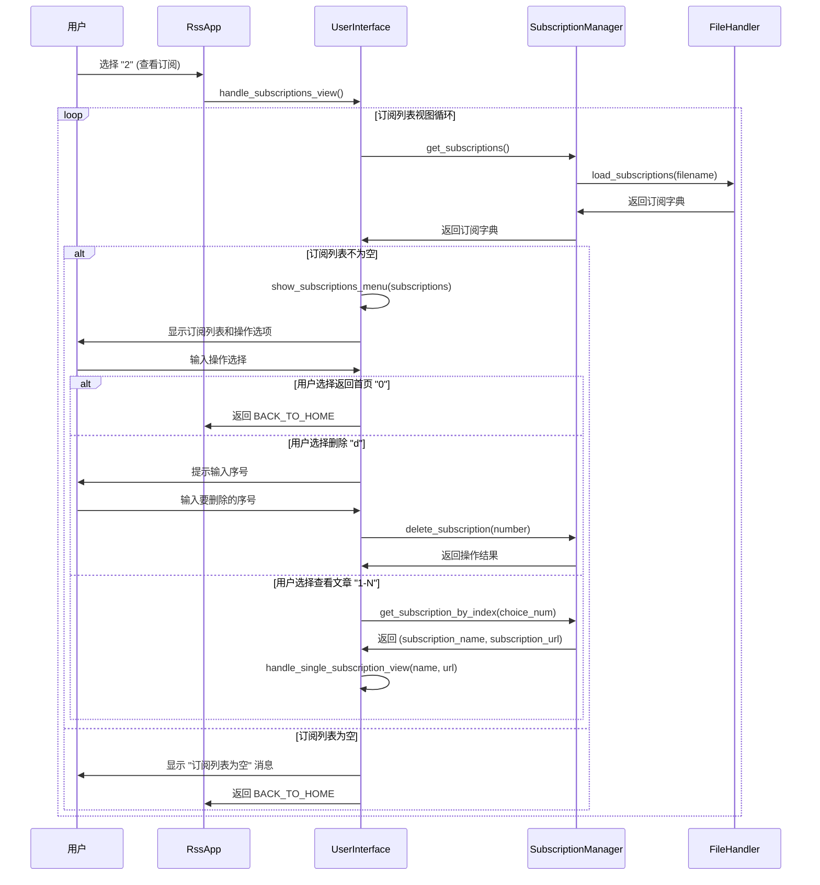
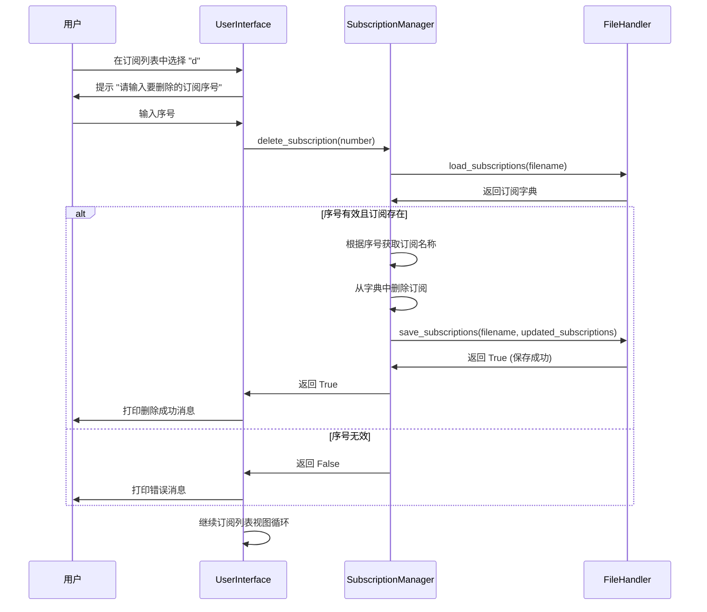
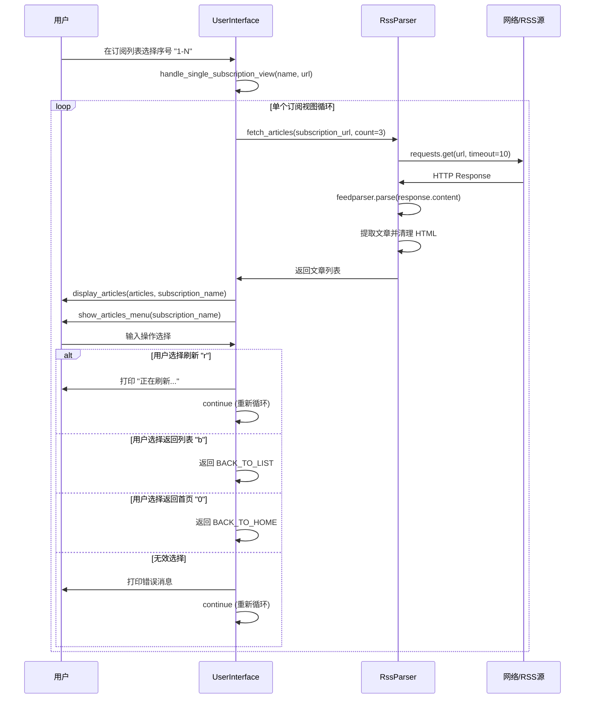
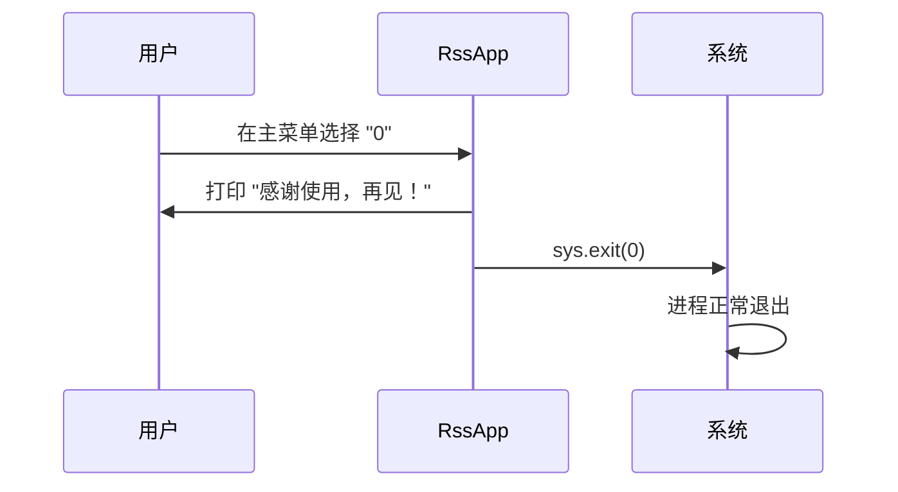

# RSS 订阅管理系统架构分析文档

## 目录
- [概述](#概述)
- [架构总览](#架构总览)
- [模块与类清单](#模块与类清单)
- [类详解](#类详解)
- [方法调用关系](#方法调用关系)
- [关键用例时序图](#关键用例时序图)
- [数据与持久化](#数据与持久化)
- [外部依赖与网络交互](#外部依赖与网络交互)
- [错误处理与边界条件](#错误处理与边界条件)
- [可扩展性与改进建议](#可扩展性与改进建议)
- [附录](#附录)

## 概述

`demo_refactored.py` 是一个基于 Python 的 RSS 订阅管理系统，采用面向对象的设计，支持：
- 添加新的 RSS 订阅源
- 将订阅源信息（标题和链接）保存到本地 JSON 文件
- 加载并显示所有已保存的订阅源
- 查看单个订阅源的最新文章
- 删除不需要的订阅
- 通过命令行界面与用户交互

### 运行方式
直接执行 `python demo_refactored.py`，进入命令行交互界面。

## 架构总览

### 分层架构
该系统采用分层架构设计，从上到下分为：
1. **应用控制层** - `RssApp`：主程序入口和路由控制
2. **用户界面层** - `UserInterface`：CLI 交互和菜单显示
3. **业务逻辑层** - `SubscriptionManager`：订阅管理业务逻辑
4. **服务层** - `RssParser` 和 `FileHandler`：网络解析和文件操作服务
5. **模型层** - `NavigationAction`：枚举定义

### 依赖关系图



## 模块与类清单

### 1. NavigationAction（枚举类）
**角色**：定义用户在视图间导航的动作常量
**职责**：替代魔术字符串，提供类型安全的导航选项
- `BACK_TO_LIST`：返回订阅列表视图  
- `BACK_TO_HOME`：返回主菜单

### 2. FileHandler（静态工具类）
**角色**：文件操作服务层
**职责**：负责 JSON 文件的读写操作
**外部依赖**：`json`、`os`
**副作用**：文件系统 I/O 操作

### 3. RssParser（服务类）
**角色**：RSS 解析和网络请求服务层
**职责**：网络 HTTP 请求、RSS 源解析、HTML 内容清理
**外部依赖**：`requests`、`feedparser`、`re`、`html`
**副作用**：网络 I/O、标准输出打印

### 4. SubscriptionManager（业务逻辑类）
**角色**：订阅管理业务逻辑层
**职责**：订阅的增删改查、索引访问、业务规则控制
**依赖**：`FileHandler`、`RssParser`
**副作用**：文件操作、网络请求、标准输出打印

### 5. UserInterface（表示层）
**角色**：用户界面和交互控制层
**职责**：CLI 菜单显示、用户输入处理、视图导航控制
**依赖**：`SubscriptionManager`、`RssParser`
**副作用**：标准输入输出操作

### 6. RssApp（控制层）
**角色**：应用程序主控制器
**职责**：程序主循环、路由分发、应用生命周期管理
**依赖**：`UserInterface`
**副作用**：标准输入输出、进程退出

## 类详解

### NavigationAction

```python
class NavigationAction(Enum):
    BACK_TO_LIST = auto()
    BACK_TO_HOME = auto()
```

**属性**：
- 枚举值用于视图导航状态管理

**方法**：无（枚举类）

### FileHandler

**属性**：无（静态类）

**方法**：
- `load_subscriptions(filename: str) -> Dict[str, str]`
  - **功能**：从 JSON 文件加载订阅字典
  - **输入**：文件路径字符串
  - **输出**：订阅字典（标题->URL 映射）
  - **副作用**：文件读取操作，异常时打印警告
  - **错误处理**：文件不存在或 JSON 解析失败时返回空字典

- `save_subscriptions(filename: str, subscriptions: Dict[str, str]) -> bool`
  - **功能**：将订阅字典保存到 JSON 文件
  - **输入**：文件路径、订阅字典
  - **输出**：保存成功返回 True，失败返回 False
  - **副作用**：文件写入操作，异常时打印错误信息
  - **错误处理**：捕获所有异常，返回布尔值表示结果

### RssParser

**属性**：
- `timeout: int`：HTTP 请求超时时间（默认 10 秒）

**方法**：
- `fetch_feed_info(url: str) -> Tuple[Optional[str], bool]`
  - **功能**：获取 RSS 源的标题信息
  - **输入**：RSS 源 URL
  - **输出**：(标题, 是否成功) 元组
  - **副作用**：网络请求、标准输出打印状态信息
  - **错误处理**：网络异常返回 (None, False)，RSS 解析警告但继续

- `fetch_articles(url: str, count: int = 3) -> List[Dict[str, str]]`
  - **功能**：获取 RSS 源的最新文章列表
  - **输入**：RSS 源 URL、文章数量限制
  - **输出**：文章字典列表，每个字典包含 title、link、summary 键
  - **副作用**：网络请求、HTML 内容清理
  - **错误处理**：网络或解析异常返回空列表

- `_clean_html(text: str) -> str`
  - **功能**：清理 HTML 标签和格式化文本
  - **输入**：包含 HTML 的原始文本
  - **输出**：清理后的纯文本
  - **副作用**：无
  - **处理**：正则表达式去除标签、规整空白、HTML 实体解码

### SubscriptionManager

**属性**：
- `filename: str`：存储订阅的 JSON 文件名
- `file_handler: FileHandler`：文件操作服务实例
- `rss_parser: RssParser`：RSS 解析服务实例

**方法**：
- `add_subscription(url: str) -> bool`
  - **功能**：添加新的 RSS 订阅
  - **输入**：RSS 源 URL
  - **输出**：添加成功返回 True，失败返回 False
  - **副作用**：网络请求、文件读写、标准输出提示
  - **流程**：解析 RSS 获取标题 → 加载现有订阅 → 合并保存
  - **错误处理**：任何步骤失败都返回 False

- `delete_subscription(number: int) -> bool`
  - **功能**：根据序号删除订阅
  - **输入**：订阅序号（从 1 开始）
  - **输出**：删除成功返回 True，失败返回 False
  - **副作用**：文件读写、标准输出提示
  - **错误处理**：序号无效或操作失败返回 False

- `get_subscriptions() -> Dict[str, str]`
  - **功能**：获取所有订阅
  - **输入**：无
  - **输出**：订阅字典
  - **副作用**：文件读取
  - **错误处理**：委托给 FileHandler

- `get_subscription_by_index(index: int) -> Tuple[Optional[str], Optional[str]]`
  - **功能**：根据索引获取特定订阅
  - **输入**：订阅索引（从 1 开始）
  - **输出**：(订阅名称, 订阅URL) 元组，失败返回 (None, None)
  - **副作用**：文件读取
  - **错误处理**：索引无效返回 None 值

### UserInterface

**属性**：
- `subscription_manager: SubscriptionManager`：订阅管理服务实例
- `rss_parser: RssParser`：RSS 解析服务实例

**方法**：
- `show_main_menu()`：显示主菜单选项
- `show_subscriptions_menu(subscriptions: Dict[str, str])`：显示订阅列表菜单
- `show_articles_menu(subscription_name: str)`：显示文章操作菜单
- `display_articles(articles: List[Dict[str, str]], subscription_name: str)`：显示文章列表
- `get_user_input(prompt: str) -> str`：获取用户输入
- `handle_subscriptions_view() -> NavigationAction`：处理订阅列表视图交互循环
- `handle_single_subscription_view(subscription_name: str, subscription_url: str) -> NavigationAction`：处理单个订阅视图交互循环

### RssApp

**属性**：
- `ui: UserInterface`：用户界面实例

**方法**：
- `run()`：应用程序主循环，处理用户选择和路由分发
- `_handle_add_subscription()`：处理添加订阅的业务流程
- `_handle_view_subscriptions()`：处理查看订阅的业务流程

## 方法调用关系

### 静态依赖关系
1. **直接依赖**：
   - `RssApp` → `UserInterface`
   - `UserInterface` → `SubscriptionManager` + `RssParser`
   - `SubscriptionManager` → `FileHandler` + `RssParser`

2. **间接依赖**：
   - `RssApp` 间接依赖所有下层组件
   - 所有组件间接依赖外部库（requests、feedparser、json 等）

3. **枚举使用**：
   - `UserInterface` 的导航方法返回 `NavigationAction` 枚举值

### 动态调用流程
主要的方法调用链路：

1. **应用启动**：
   ```
   main → RssApp() → UserInterface() → SubscriptionManager() → FileHandler() + RssParser()
   ```

2. **添加订阅流程**：
   ```
   RssApp.run() → _handle_add_subscription() → SubscriptionManager.add_subscription() 
   → RssParser.fetch_feed_info() → FileHandler.save_subscriptions()
   ```

3. **查看订阅流程**：
   ```
   RssApp.run() → _handle_view_subscriptions() → UserInterface.handle_subscriptions_view()
   → SubscriptionManager.get_subscriptions() → FileHandler.load_subscriptions()
   ```

## 关键用例时序图

### 1. 添加订阅用例



**流程要点**：
1. 用户输入 RSS URL
2. 网络请求解析 RSS 源获取标题
3. 加载现有订阅并合并新订阅
4. 保存更新后的订阅到 JSON 文件
5. 显示成功提示并返回主菜单

### 2. 查看订阅列表用例



**流程要点**：
1. 从文件加载所有订阅
2. 显示订阅列表和操作菜单
3. 处理用户选择（返回/删除/查看文章）
4. 根据选择执行对应操作
5. 在视图间导航或返回主菜单

### 3. 删除订阅用例



**流程要点**：
1. 用户在订阅列表中选择删除操作
2. 输入要删除的订阅序号
3. 验证序号有效性
4. 从订阅字典中移除对应项
5. 保存更新后的订阅到文件
6. 显示操作结果并继续列表视图

### 4. 查看文章/刷新用例



**流程要点**：
1. 根据用户选择获取订阅信息
2. 请求 RSS 源获取最新文章
3. 解析并清理文章内容
4. 显示文章列表和操作菜单
5. 处理刷新、返回等用户操作
6. 支持循环刷新和视图导航

### 5. 退出应用用例



**流程要点**：
1. 用户在主菜单选择退出选项
2. 打印退出提示信息
3. 调用系统退出函数正常结束进程

## 数据与持久化

### JSON 文件结构

**文件名**：`subscriptions.json`

**数据格式**：
```json
{
  "订阅标题1": "https://example.com/rss1",
  "订阅标题2": "https://example.com/rss2",
  "未命名订阅_20240816123045": "https://example.com/rss3"
}
```

**特点**：
- 键：RSS 源的标题（从 RSS feed 解析获得）
- 值：RSS 源的 URL
- 编码：UTF-8，`ensure_ascii=False` 支持中文
- 格式：缩进 2 空格的格式化 JSON

### 数据流

#### 添加订阅数据流
```
用户输入URL → 网络请求解析标题 → 内存字典合并 → JSON序列化写入文件
```

#### 删除订阅数据流  
```
用户输入序号 → 序号映射到标题 → 内存字典删除 → JSON序列化写入文件
```

#### 查看订阅数据流
```
文件读取 → JSON反序列化 → 内存字典 → 遍历显示
```

### 边界情况处理

#### 文件不存在或损坏
- **处理**：返回空字典 `{}`
- **用户体验**：显示警告信息但不中断程序
- **恢复机制**：首次添加订阅时自动创建文件

#### 标题冲突
- **行为**：后添加的订阅覆盖同名订阅
- **原因**：字典键的唯一性约束
- **影响**：可能导致订阅丢失，但不会出现数据异常

#### 网络解析失败时的标题生成
- **策略**：使用时间戳生成默认标题
- **格式**：`"未命名订阅_{YYYYMMDDHHMMSS}"`
- **目的**：确保即使无法解析标题也能保存订阅

## 外部依赖与网络交互

### 网络请求层

#### HTTP 请求配置
- **库**：`requests`
- **超时设置**：10 秒（可配置）
- **异常处理**：`requests.exceptions.RequestException`
- **状态码检查**：`response.raise_for_status()`

#### RSS 解析配置
- **库**：`feedparser`
- **容错机制**：`feed.bozo` 检测格式异常但不中断处理
- **字段提取**：`feed.feed.title`、`entry.title`、`entry.link`、`entry.summary`

### HTML 内容清理

#### 清理流程
```python
def _clean_html(self, text: str) -> str:
    # 1. 正则表达式去除 HTML 标签
    clean_text = re.sub(r'<[^>]+>', '', text)
    # 2. 规整连续空白字符
    clean_text = re.sub(r'\s+', ' ', clean_text)  
    # 3. HTML 实体解码
    clean_text = html.unescape(clean_text)
    return clean_text.strip()
```

#### 处理内容
- **HTML 标签**：完全移除
- **HTML 实体**：解码为正常字符（如 `&amp;` → `&`）
- **空白字符**：多个连续空白合并为单个空格
- **前后空白**：trim 处理

### 网络异常处理策略

#### 超时和连接异常
- **捕获**：`requests.exceptions.RequestException`
- **响应**：打印错误信息，返回失败标记
- **用户体验**：不中断程序流程，允许重试其他操作

#### RSS 解析异常
- **容错**：`feedparser` 的 `bozo` 机制检测但不阻断
- **降级**：解析失败时使用默认标题和空文章列表
- **日志**：打印警告信息供用户参考

## 错误处理与边界条件

### 用户输入验证

#### 菜单选择处理
```python
try:
    choice = input("请选择操作：").strip()
    if choice == "0":
        return NavigationAction.BACK_TO_HOME
    elif choice.lower() == "d":
        # 删除操作
    else:
        choice_num = int(choice)  # 可能抛出 ValueError
        if 1 <= choice_num <= len(subscriptions):
            # 有效选择
        else:
            print("❌ 无效的选择，请输入正确的序号。")
except ValueError:
    print("❌ 请输入有效的数字序号。")
```

#### 输入类型和范围验证
- **数字输入**：捕获 `ValueError`，提示重新输入
- **范围检查**：确保序号在有效范围内
- **空输入处理**：`strip()` 去除前后空白
- **大小写处理**：字母选项支持大小写不敏感

### 方法失败路径

#### 文件操作异常
- **读取失败**：返回空字典，打印警告，程序继续
- **写入失败**：返回 `False`，打印错误信息，用户可重试
- **权限问题**：捕获并报告，不崩溃

#### 网络操作异常
- **连接超时**：返回失败标记，允许用户稍后重试
- **HTTP 错误**：捕获状态码异常，返回失败标记
- **解析错误**：容错处理，使用默认值

#### 业务逻辑边界
- **空订阅列表**：显示提示信息，导航回主菜单
- **无效序号**：提示错误，继续当前视图循环
- **重复订阅**：覆盖策略，打印成功信息

### 异常传播策略

#### 异常捕获层级
1. **最底层**（FileHandler、RssParser）：捕获具体异常，返回错误标记
2. **中间层**（SubscriptionManager）：检查底层返回值，传播失败状态  
3. **表示层**（UserInterface）：处理失败状态，显示用户友好消息
4. **控制层**（RssApp）：处理顶层流程异常，确保程序稳定

#### 错误恢复机制
- **自动重试**：部分网络操作支持用户手动重试
- **降级处理**：关键功能失败时提供基本功能
- **状态保持**：错误不影响已保存的数据和程序状态

### 进程控制

#### 正常退出
- **触发条件**：用户选择主菜单 "0" 选项
- **退出方式**：`sys.exit(0)` 正常退出码
- **清理工作**：无需特殊清理（文件自动关闭）

#### 异常退出
- **未处理异常**：Python 默认异常处理，打印堆栈跟踪
- **键盘中断**：`Ctrl+C` 可直接终止程序
- **系统信号**：支持标准的进程终止信号

## 可扩展性与改进建议

### 架构改进

#### 1. 接口抽象和依赖注入
**当前问题**：类之间直接实例化依赖，难以测试和替换实现
```python
# 当前实现
class SubscriptionManager:
    def __init__(self, filename: str = "subscriptions.json"):
        self.file_handler = FileHandler()  # 硬编码依赖
        self.rss_parser = RssParser()
```

**建议改进**：引入接口和依赖注入
```python
# 改进方案
from abc import ABC, abstractmethod

class FileHandlerInterface(ABC):
    @abstractmethod
    def load_subscriptions(self, filename: str) -> Dict[str, str]:
        pass

class SubscriptionManager:
    def __init__(self, file_handler: FileHandlerInterface, 
                 rss_parser: RssParserInterface, filename: str):
        self.file_handler = file_handler
        self.rss_parser = rss_parser
        self.filename = filename
```

#### 2. 配置管理
**当前问题**：硬编码配置分散在各个类中

**建议改进**：统一配置管理
```python
@dataclass
class Config:
    subscription_file: str = "subscriptions.json"
    request_timeout: int = 10
    default_article_count: int = 3
    max_summary_length: int = 200
```

#### 3. 错误处理统一化
**建议改进**：使用 Result 模式或自定义异常层次
```python
from typing import Union, Generic, TypeVar

T = TypeVar('T')
E = TypeVar('E')

class Result(Generic[T, E]):
    def __init__(self, value: T = None, error: E = None):
        self._value = value
        self._error = error
    
    def is_success(self) -> bool:
        return self._error is None
```

### 功能扩展

#### 1. 订阅分类和标签
- 支持订阅分组管理
- 添加标签系统便于筛选
- 支持订阅的启用/禁用状态

#### 2. 文章缓存和离线阅读
- 本地缓存文章内容
- 支持离线模式浏览
- 文章全文抓取功能

#### 3. 搜索和过滤
- 订阅标题搜索
- 文章内容全文搜索
- 基于关键词的文章过滤

#### 4. 导入导出功能
- OPML 格式支持
- 支持从其他 RSS 阅读器导入
- 配置和数据的备份恢复

### 可测试性改进

#### 1. 单元测试矩阵
```python
# 测试覆盖建议
class TestFileHandler:
    def test_load_nonexistent_file(self):
        # 测试文件不存在场景
        
    def test_load_corrupted_json(self):
        # 测试 JSON 格式错误场景
        
    def test_save_permission_denied(self):
        # 测试文件权限问题

class TestRssParser:
    def test_fetch_valid_rss(self):
        # 测试正常 RSS 解析
        
    def test_fetch_network_timeout(self):
        # 测试网络超时场景
        
    def test_fetch_invalid_rss(self):
        # 测试无效 RSS 格式
```

#### 2. 集成测试策略
- 使用 Mock 对象隔离外部依赖
- 创建测试专用的配置和数据文件
- 自动化的端到端测试场景

### 用户体验改进

#### 1. 交互优化
- 添加订阅时的 URL 格式验证
- 删除操作的确认机制
- 批量操作支持（批量删除、导入）

#### 2. 错误提示改进
- 更详细的错误信息和建议
- 网络问题的重试机制
- 进度指示器（长时间网络操作）

#### 3. 数据安全
- 订阅数据的备份机制
- 重复标题冲突的智能处理
- 数据迁移和版本兼容性

### 性能优化

#### 1. 并发处理
- 多线程获取文章内容
- 异步 HTTP 请求
- 批量操作的性能优化

#### 2. 缓存策略
- HTTP 响应缓存
- 解析结果缓存
- 智能的缓存失效机制

#### 3. 内存管理
- 大量订阅时的分页处理
- 流式处理大文件
- 内存使用监控

### 监控和日志

#### 1. 结构化日志
```python
import logging
import structlog

logger = structlog.get_logger()

logger.info("subscription_added", 
           url=url, 
           title=title, 
           success=True,
           duration_ms=response_time)
```

#### 2. 指标收集
- 订阅成功率
- 网络请求延迟分布
- 用户操作统计
- 错误类型分析

## 附录

### 术语定义

- **RSS**：Really Simple Syndication，一种用于发布网站内容更新的 XML 格式
- **Feed**：RSS 源，包含网站最新内容的 XML 文档
- **Entry**：RSS 源中的单篇文章或条目
- **Bozo**：feedparser 库中用于标识解析异常的标志
- **Magic String**：硬编码的字符串常量，使用枚举可以避免此问题

### 返回值约定

#### 布尔返回值语义
- `True`：操作成功完成
- `False`：操作失败，但程序可继续运行

#### 可选返回值语义  
- `Optional[T]`：`None` 表示未找到或操作失败
- `Tuple[Optional[T], bool]`：元组形式，布尔值指示操作是否成功

#### 集合返回值语义
- 空列表 `[]`：查询成功但无结果，或操作失败
- 空字典 `{}`：加载成功但无数据，或文件不存在

### 常见问题

#### Q: 为什么使用字典而不是列表存储订阅？
A: 字典提供了标题到 URL 的直接映射，便于查找和去重。缺点是标题重复时会覆盖。

#### Q: 网络请求失败时如何重试？
A: 当前版本不支持自动重试。用户可以通过重新执行操作来手动重试。

#### Q: 如何处理 RSS 源更新频率？
A: 当前版本每次都实时请求。未来可考虑添加缓存和增量更新机制。

#### Q: 支持哪些 RSS 格式？
A: 通过 feedparser 库支持 RSS 1.0、RSS 2.0、Atom 等主流格式。

#### Q: 文章摘要长度如何控制？
A: 当前固定截取前 200 个字符。可通过配置参数进行调整。

---

*本文档基于 demo_refactored.py 源代码分析生成，版本日期：2024-08-16*
