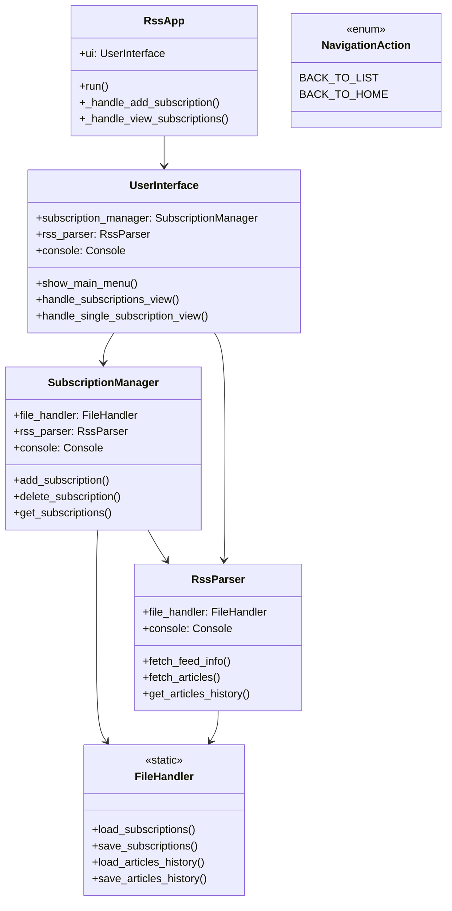
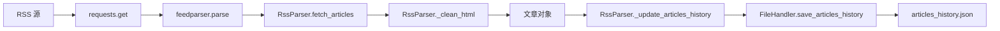
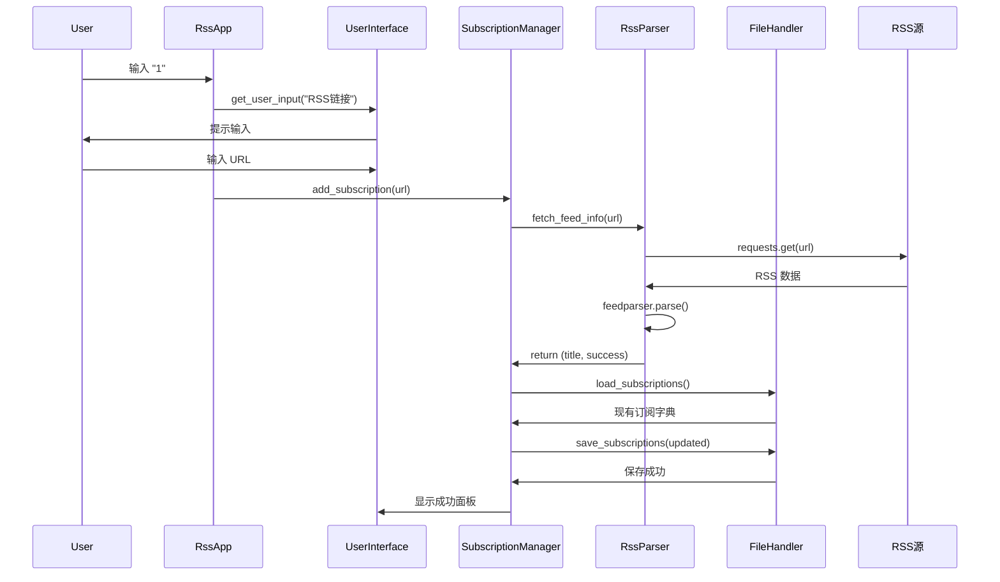
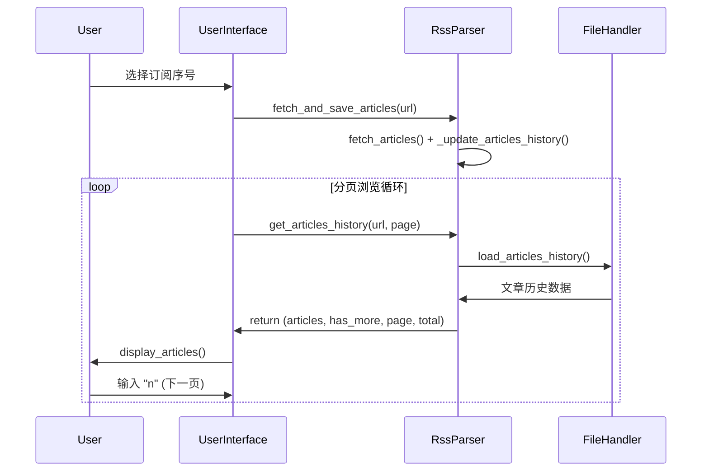

# RSS 订阅管理系统架构分析文档

## 概览与目标

本文档全面梳理 `demo_refactored.py` 中的类、方法、函数之间的调用关系，旨在为开发者提供清晰的架构视图，便于理解系统组件协作关系、数据流向和维护扩展。

### 文档范围
- **覆盖内容**：`demo_refactored.py` 中的所有类、方法、函数调用关系
- **不包括**：运行时性能、UI 视觉效果、网络可达性等非架构相关内容

---

## 架构总览与组件职责

### 系统组件清单

| 组件 | 类型 | 主要职责 |
|------|------|----------|
| `NavigationAction` | 枚举 | 定义用户导航动作常量 |
| `FileHandler` | 工具类 | JSON 文件读写操作 |
| `RssParser` | 服务类 | RSS 源解析与文章获取 |
| `SubscriptionManager` | 管理类 | 订阅源的增删改查 |
| `UserInterface` | 界面类 | 用户交互与界面展示 |
| `RssApp` | 控制器类 | 应用程序主控制器 |

### 架构层次说明

```
RssApp (应用控制层)
    └── UserInterface (用户界面层)
            ├── SubscriptionManager (业务逻辑层)
            │       ├── RssParser (网络服务层)
            │       └── FileHandler (数据访问层)
            └── RssParser (网络服务层)
                    └── FileHandler (数据访问层)
```

---

## 类与继承关系

### 继承关系
- `NavigationAction(Enum)` - 继承自标准库 `Enum`
- 其余类均为独立类，无继承关系

### 组合依赖关系



**文字化依赖关系**：
- `RssApp` 组合 `UserInterface`
- `UserInterface` 组合 `SubscriptionManager`, `RssParser`, `Console`
- `SubscriptionManager` 组合 `FileHandler`, `RssParser`, `Console`
- `RssParser` 组合 `FileHandler`, `Console`

---

## 组件依赖与协作关系

### 依赖层级分析

**第一层（基础层）**：
- `NavigationAction` - 导航常量定义
- `FileHandler` - 文件操作工具

**第二层（服务层）**：
- `RssParser` - 依赖 `FileHandler`

**第三层（业务层）**：
- `SubscriptionManager` - 依赖 `FileHandler` 和 `RssParser`

**第四层（界面层）**：
- `UserInterface` - 依赖 `SubscriptionManager` 和 `RssParser`

**第五层（控制层）**：
- `RssApp` - 依赖 `UserInterface`

### 核心协作模式

1. **分层调用**：上层调用下层，避免跨层直接调用
2. **职责分离**：每个类专注单一职责
3. **依赖注入**：通过组合而非继承实现功能复用

---

## 方法调用关系与典型调用链

### 方法调用邻接表

#### RssApp
- **调用者**：`__main__`
- **调用**：
  - `UserInterface.show_main_menu()`
  - `UserInterface.get_user_input()`
  - `SubscriptionManager.add_subscription()` (通过 `UserInterface`)
  - `UserInterface.handle_subscriptions_view()`

#### UserInterface
- **调用者**：`RssApp`
- **调用**：
  - `SubscriptionManager.get_subscriptions()`
  - `SubscriptionManager.add_subscription()`
  - `SubscriptionManager.delete_subscription()`
  - `SubscriptionManager.get_subscription_by_index()`
  - `RssParser.fetch_and_save_articles()`
  - `RssParser.get_articles_history()`
  - `Console.print()`

#### SubscriptionManager
- **调用者**：`UserInterface`
- **调用**：
  - `RssParser.fetch_feed_info()`
  - `FileHandler.load_subscriptions()`
  - `FileHandler.save_subscriptions()`
  - `Console.print()`

#### RssParser
- **调用者**：`SubscriptionManager`, `UserInterface`
- **调用**：
  - `requests.get()`
  - `feedparser.parse()`
  - `FileHandler.load_articles_history()`
  - `FileHandler.save_articles_history()`
  - `_clean_html()` (内部方法)
  - `_update_articles_history()` (内部方法)

#### FileHandler
- **调用者**：`RssParser`, `SubscriptionManager`
- **调用**：
  - `json.load()`
  - `json.dump()`
  - `os.path.exists()`

### 关键调用链分析

#### 1. 添加订阅流程
```
RssApp.run() 
→ UserInterface.get_user_input()
→ RssApp._handle_add_subscription()
→ SubscriptionManager.add_subscription()
→ RssParser.fetch_feed_info()
→ requests.get() / feedparser.parse()
→ FileHandler.load_subscriptions() / save_subscriptions()
```

#### 2. 查看订阅流程
```
RssApp.run()
→ RssApp._handle_view_subscriptions()
→ UserInterface.handle_subscriptions_view()
→ SubscriptionManager.get_subscriptions()
→ FileHandler.load_subscriptions()
→ UserInterface.show_subscriptions_menu()
```

#### 3. 单订阅文章浏览流程
```
UserInterface.handle_subscriptions_view()
→ UserInterface.handle_single_subscription_view()
→ RssParser.fetch_and_save_articles() [首次/刷新]
→ RssParser.fetch_articles()
→ RssParser._clean_html()
→ RssParser._update_articles_history()
→ RssParser.get_articles_history() [分页展示]
→ UserInterface.display_articles()
```

---

## 数据流与持久化模型

### 数据存储结构

#### 1. 订阅数据 (`subscriptions.json`)
```json
{
  "订阅标题1": "https://example.com/rss1",
  "订阅标题2": "https://example.com/rss2"
}
```

**数据流**：
- **生产者**：`SubscriptionManager.add_subscription()`
- **消费者**：`SubscriptionManager.get_subscriptions()`
- **存储层**：`FileHandler.save_subscriptions()` / `load_subscriptions()`

#### 2. 文章历史 (`articles_history.json`)
```json
{
  "https://example.com/rss1": [
    {
      "title": "文章标题",
      "link": "https://example.com/article1",
      "summary": "文章摘要",
      "published": "Mon, 01 Jan 2024 00:00:00 GMT",
      "fetch_time": "2024-01-01T12:00:00"
    }
  ]
}
```

**数据流**：
- **生产者**：`RssParser.fetch_and_save_articles()` → `_update_articles_history()`
- **消费者**：`RssParser.get_articles_history()` → `UserInterface.display_articles()`
- **存储层**：`FileHandler.save_articles_history()` / `load_articles_history()`

### 外部数据源流程



**文字化流程**：
1. **网络获取**：`requests.get()` 从 RSS 源获取原始数据
2. **解析处理**：`feedparser.parse()` 解析 RSS/Atom 格式
3. **内容清洗**：`RssParser._clean_html()` 使用 `BeautifulSoup` 清理 HTML
4. **数据整合**：构建包含 `title`, `link`, `summary`, `published`, `fetch_time` 的文章对象
5. **去重存储**：`RssParser._update_articles_history()` 基于链接去重后存储
6. **持久化**：`FileHandler` 将数据序列化到 JSON 文件

---

## 异常与错误处理流

### 网络层异常处理

#### RSS 获取异常分支
```python
# RssParser.fetch_feed_info() / fetch_articles()
try:
    response = requests.get(url, timeout=self.timeout)
    response.raise_for_status()
except SSLError → 返回 None/[], 输出 SSL 错误提示
except Timeout → 返回 None/[], 输出超时提示  
except ConnectionError → 返回 None/[], 输出连接错误提示
except HTTPError → 返回 None/[], 输出 HTTP 状态码错误
except RequestException → 返回 None/[], 输出一般网络错误
except Exception → 返回 None/[], 输出未知错误
```

#### 解析告警处理
```python
# RssParser.fetch_feed_info()
if feed.bozo:
    print(f"警告：链接可能不是有效的 RSS/Atom 源。错误：{feed.bozo_exception}")
# 继续执行，不中断流程
```

### 文件层异常处理

#### JSON 文件操作
```python
# FileHandler.load_subscriptions() / load_articles_history()  
try:
    with open(filename, "r") as f:
        return json.load(f)
except (json.JSONDecodeError, FileNotFoundError):
    return {}  # 降级为空数据，不中断程序
except Exception:
    return {}  # 兜底处理
```

### UI 层健壮性处理

#### 用户输入验证
- **无效序号**：`choice_num` 超出范围时提示并重新输入
- **非数字输入**：`ValueError` 捕获后提示格式错误
- **越界分页**：显示 "已经是第一页/最后一页" 提示
- **链接打开失败**：`webbrowser.open()` 异常时提示无法打开

#### 导航状态管理
- **空订阅列表**：显示提示面板，自动返回主页
- **无文章数据**：显示警告面板，保持当前视图

---

## 外部依赖与系统边界

### 第三方库依赖

| 库名 | 用途 | 调用位置 | 替换难度 |
|------|------|----------|----------|
| `requests` | HTTP 请求 | `RssParser.fetch_*` | 低 (urllib) |
| `feedparser` | RSS/Atom 解析 | `RssParser.fetch_*` | 中 (自实现 XML 解析) |
| `beautifulsoup4` | HTML 清洗 | `RssParser._clean_html` | 低 (正则表达式) |
| `rich` | 终端美化显示 | `UserInterface.*` | 低 (标准 print) |
| `webbrowser` | 打开链接 | `UserInterface.handle_single_subscription_view` | 无 (系统调用) |

### 系统边界与环境假设

#### 网络边界
- **互联网访问**：`requests.get()` 需要网络连接
- **DNS 解析**：依赖系统 DNS 服务
- **SSL/TLS**：依赖系统证书存储

#### 文件系统边界  
- **当前工作目录写权限**：存储 `subscriptions.json`, `articles_history.json`
- **JSON 编码**：假设系统支持 UTF-8

#### 终端环境边界
- **Rich 渲染支持**：优雅降级到纯文本
- **用户输入支持**：依赖标准输入流

---

## 典型用户场景调用时序

### 场景 1：添加新订阅



### 场景 2：浏览文章并分页



---

## 维护建议与变更影响

### 代码变更影响分析

#### 高影响变更
- **`FileHandler` 方法签名变更**：影响所有数据持久化功能
- **`RssParser.fetch_*` 返回值结构变更**：影响 UI 展示和数据存储
- **`NavigationAction` 枚举变更**：影响用户导航逻辑

#### 中等影响变更  
- **`UserInterface` 显示方法变更**：主要影响用户体验
- **异常处理策略变更**：影响系统健壮性

#### 低影响变更
- **内部私有方法重构**：如 `RssParser._clean_html`
- **常量值调整**：如超时时间、分页大小

### 扩展建议

#### 架构优化方向
1. **配置外部化**：将超时、分页等配置提取到配置文件
2. **依赖注入**：引入 DI 容器，提高可测试性
3. **接口抽象**：为 `FileHandler`, `RssParser` 定义抽象接口

#### 功能扩展点
1. **存储后端可插拔**：支持数据库存储
2. **RSS 解析器可扩展**：支持更多 feed 格式
3. **UI 渲染器可选择**：支持 Web UI、GUI 等

### 自动化维护建议

#### 文档同步策略
- **代码变更触发**：任何方法签名变更都应更新此文档
- **CI 检查**：引入静态分析工具验证调用关系一致性
- **版本标记**：在文档中标记对应的代码版本

#### 测试覆盖建议
- **单元测试**：为每个类的公有方法编写测试
- **集成测试**：覆盖关键调用链的端到端测试  
- **异常测试**：验证各类异常场景的处理逻辑

---

## 总结

`demo_refactored.py` 采用了清晰的分层架构，通过组合而非继承实现功能复用，各组件职责明确，依赖关系合理。系统具备良好的异常处理机制和用户交互体验。

**关键特点**：
- **分层清晰**：控制层 → 界面层 → 业务层 → 服务层 → 数据访问层
- **职责单一**：每个类专注特定领域的功能
- **错误健壮**：全面的异常处理和用户友好的错误提示
- **数据安全**：基于链接去重的文章存储，防止重复数据

**维护要点**：
- 保持现有的分层结构，避免跨层直接调用
- 新增功能时遵循单一职责原则
- 变更时同步更新文档，确保架构视图准确性

---

*本文档生成时间：2024-01-01*  
*对应源码版本：demo_refactored.py*
